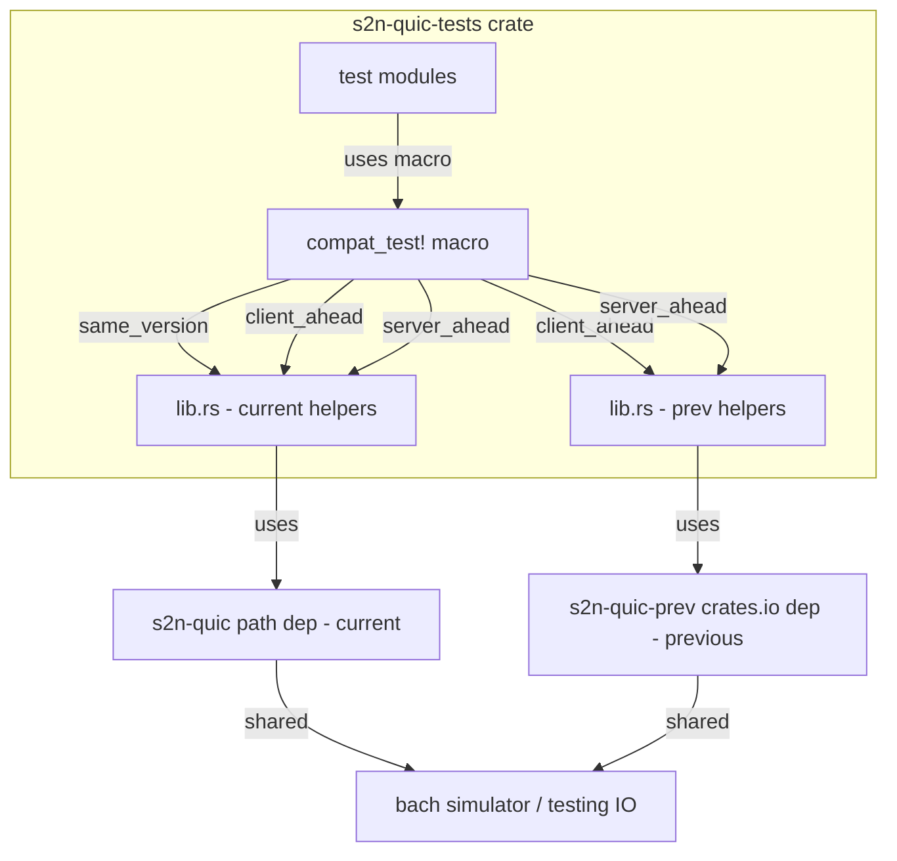

# Design Document: Cross-Version Testing

## Overview

This design introduces cross-version compatibility testing to the `s2n-quic-tests` integration test suite. The goal is to run each existing test in three version configurations — same-version, client-ahead, and server-ahead — with minimal developer effort for new tests.

The core challenge is that Rust's type system treats types from two different versions of the same crate as distinct. A `Client` from `s2n-quic v1.52` is a different type than a `Client` from the local working tree. Since `Client` and `Server` are concrete types after `.start()` is called, the cross-version boundary must be handled at the builder/construction level.

### Key Insight: Shared Concrete Types After `.start()`

After calling `.start()`, both `Client` and `Server` are concrete, non-generic types. The `Client` can `.connect()` and the `Server` can `.accept()`, producing `Connection` objects. The wire protocol is the same regardless of version. The challenge is only in *constructing* the client and server — once built, they operate independently.

### Approach: Same Crate, Renamed Dependency, Macro Wrapping

1. Add `s2n-quic-prev` as a renamed dependency in `s2n-quic-tests/Cargo.toml` pointing to the last published release.
2. Provide `prev_*` versions of the existing helper functions (`prev_server()`, `prev_client()`, `prev_build_server()`, `prev_build_client()`) that use the previous version's types.
3. Introduce a `compat_test!` macro that wraps test functions to run them three times — once per version configuration — by selecting the appropriate helpers.
4. Developers write tests exactly as they do today. The macro is applied to the test module or function to enable cross-version execution.

## Architecture



### Dependency Setup

```toml
# In s2n-quic-tests/Cargo.toml
[dependencies]
# Current versions (path dependencies)
s2n-quic = { path = "../s2n-quic", features = [...] }
s2n-quic-core = { path = "../s2n-quic-core", features = [...] }
s2n-codec = { path = "../../common/s2n-codec" }
s2n-quic-platform = { path = "../s2n-quic-platform", features = [...] }
s2n-quic-transport = { path = "../s2n-quic-transport", features = [...] }

# Previous versions (crates.io, renamed)
s2n-quic-prev = { package = "s2n-quic", version = "1.52", features = [...] }
s2n-quic-core-prev = { package = "s2n-quic-core", version = "1.52", features = [...] }
s2n-codec-prev = { package = "s2n-codec", version = "0.x", features = [...] }
```

All `*-prev` dependencies point to the last published release on crates.io. The version numbers are maintained in a single place (this Cargo.toml) and updated together after each release.

Note: `s2n-quic-platform` and `s2n-quic-transport` may not need prev versions if they're not directly used in test bodies. The testing IO types (`Handle`, `Model`, `test()`, `spawn()`, `primary`, `delay`) come from `s2n-quic::provider::io::testing`, which is re-exported from the platform crate. When using the prev version's client/server, we use `s2n_quic_prev::provider::io::testing` for those types.

Both versions share the same underlying `bach` simulator, which is version-independent.

### IO Compatibility: Handle Transmute Bridge

Both versions depend on `s2n-quic-platform`, which depends on `bach` for the simulated network. Since both platform crates use `bach = "0.1.0"`, Cargo resolves them to the same `bach` crate. This means `bach::executor::Handle` is the same type in both versions.

However, the platform `Handle` type wraps `bach::executor::Handle` + `network::Buffers` with **private fields**, so we cannot construct a prev `Handle` directly. The solution is a two-part approach:

1. **`Handle::new()` constructor** (added to the current platform crate): Exposes a public constructor `Handle::new(executor, buffers)` and accessors `Handle::executor()`, `Handle::buffers()`. Once this ships, future prev versions will have this constructor available, eliminating the need for unsafe code.

2. **Transmute bridge** (for prev versions that predate the constructor): Since both `Handle` types have identical memory layout (`bach::executor::Handle` + `network::Buffers`), we use `std::mem::transmute` on a cloned handle. Compile-time assertions verify size and alignment match. The clone is critical — it properly increments `Arc` reference counts before the transmute.

```rust
pub fn to_prev_handle(handle: &Handle) -> prev_io::Handle {
    const _: () = assert!(
        std::mem::size_of::<Handle>() == std::mem::size_of::<prev_io::Handle>(),
        "Handle size mismatch between current and prev versions"
    );
    const _: () = assert!(
        std::mem::align_of::<Handle>() == std::mem::align_of::<prev_io::Handle>(),
        "Handle alignment mismatch between current and prev versions"
    );
    unsafe { std::mem::transmute(handle.clone()) }
}
```

**Bach version divergence risk**: If `bach` bumps to a new major version, the current and prev platform crates could resolve to different bach versions. The compile-time size/alignment assertions would catch this immediately. Since `bach` has historically stayed at `0.1.0` and is controlled by the same team, this is a manageable risk. The `Handle::new()` constructor eliminates this risk entirely for future version pairs.

### How the Macro Works

The key insight is that the macro can **swap the imports** rather than swap function pointers. The test body is pasted three times, each time with different `use` statements that control which version's `Client`, `Server`, and helper functions are in scope.

```rust
macro_rules! compat_test {
    ($name:ident $body:block) => {
        mod $name {
            mod same_version {
                use s2n_quic::{Client, Server, client::Connect, /* ... */};
                use crate::{server, client, build_server, build_client, 
                            start_server, start_client, SERVER_CERTS, /* ... */};
                #[test]
                fn test() $body
            }
            mod client_ahead {
                // Client from current, Server from previous
                use s2n_quic::{Client, client::Connect};
                use s2n_quic_prev::Server;
                use crate::{
                    prev_server as server, client, 
                    prev_build_server as build_server, build_client,
                    prev_start_server as start_server, start_client,
                    PREV_SERVER_CERTS as SERVER_CERTS, /* ... */
                };
                #[test]
                fn test() $body
            }
            mod server_ahead {
                // Server from current, Client from previous
                use s2n_quic::Server;
                use s2n_quic_prev::{Client, client::Connect};
                use crate::{
                    server, prev_client as client,
                    build_server, prev_build_client as build_client,
                    start_server, prev_start_client as start_client,
                    SERVER_CERTS, /* ... */
                };
                #[test]
                fn test() $body
            }
        }
    };
}
```

This approach means:
- **The test body is written exactly once**, using standard names like `Server::builder()`, `Client::builder()`, `server()`, `client()`.
- **The macro swaps which version those names resolve to** based on the configuration.
- **Complex tests work too** — calls to `Server::builder().with_tls(...).with_dc(...)` resolve to the correct version's builder.
- **Developers write tests exactly as they do today**, just wrapped in `compat_test!` instead of `#[test]`.

### Provider Type Compatibility

For this to work, provider types used in builder chains must come from the matching version. The macro handles this by aliasing all relevant types:

1. **Types from `s2n-quic-core`** (e.g., `MockDcEndpoint`, `Data`, certificates, event API types, packet interceptor traits): When building a prev-version server/client, the macro imports these from `s2n_quic_core_prev` instead of `s2n_quic_core`. The macro aliases like `use s2n_quic_core_prev::crypto::tls::testing::certificates;`.

2. **Types from `s2n-codec`** (e.g., `DecoderBufferMut`, `scatter`): Similarly aliased to `s2n_codec_prev` when needed.

3. **Types defined in the test crate** (e.g., `Random`, `BlocklistSubscriber`): These implement traits from `s2n-quic-core`. For the prev version, we need `PrevRandom` and `PrevBlocklistSubscriber` that implement the prev version's traits. These are defined in the test crate alongside the current versions.

4. **Types from `s2n-quic` itself** (e.g., `tls::default::Server`, `provider::event`): Aliased by the macro to the appropriate version.

The macro's import block for each configuration handles all of these aliases, so the test body uses unqualified names that resolve correctly.

### Handling Trait Incompatibilities

If a trait (e.g., `event::Subscriber`) changed between versions, types implementing the current trait won't work with the previous version's builder, and vice versa. In this case:

- The test crate provides `prev_*` versions of its helper types (e.g., `PrevRandom`, `PrevBlocklistSubscriber`) that implement the previous version's traits (from `s2n_quic_core_prev`).
- The macro aliases these appropriately: when building a prev-version server, `Random` resolves to `PrevRandom`.
- If the trait change is too significant to bridge, the test opts out of cross-version testing.

This is a pragmatic approach: most trait changes between adjacent releases are minor or additive, so most tests will work. When a trait does change, the `prev_*` types need to be updated — but this is a one-time cost per release.

## Components and Interfaces

### 1. Previous Version Helpers (`lib.rs` additions)

```rust
// Mirror of existing helpers using s2n_quic_prev types
pub fn prev_server(handle: &Handle, network_env: Model) -> Result<SocketAddr> { ... }
pub fn prev_build_server(handle: &Handle, network_env: Model) -> Result<s2n_quic_prev::Server> { ... }
pub fn prev_client(handle: &Handle, server_addr: SocketAddr, network_env: Model, with_blocklist: bool) -> Result { ... }
pub fn prev_build_client(handle: &Handle, network_env: Model, with_blocklist: bool) -> Result<s2n_quic_prev::Client> { ... }
pub fn prev_start_server(server: s2n_quic_prev::Server) -> Result<SocketAddr> { ... }
pub fn prev_start_client(client: s2n_quic_prev::Client, server_addr: SocketAddr, data: Data) -> Result { ... }
```

These mirror the existing helpers but use `s2n_quic_prev` types. The `Handle`, `Model`, `SocketAddr`, and `Data` types are shared (they come from `s2n-quic-core` / `s2n-quic-platform` / std).

### 2. `compat_test!` Macro

The macro generates three test modules from a single test body by swapping imports:

```rust
macro_rules! compat_test {
    ($name:ident $body:block) => {
        mod $name {
            mod same_version {
                use s2n_quic::{Client, Server, client::Connect, stream::PeerStream};
                use crate::{server, client, build_server, build_client, 
                            start_server, start_client, tracing_events,
                            Random, SERVER_CERTS, BlocklistSubscriber};
                use s2n_quic::provider::{self, event, event::events, 
                    io::testing::{self as io, network::Packet, primary, rand, spawn, test, 
                    time::delay, Handle, Model, Result},
                    packet_interceptor::Loss, tls};
                use s2n_quic_core::{crypto::tls::testing::certificates, stream::testing::Data};
                #[test]
                fn test() $body
            }
            mod client_ahead {
                use s2n_quic::Client;
                use s2n_quic::client::Connect;
                use s2n_quic_prev::Server;
                use crate::{
                    prev_server as server, client,
                    prev_build_server as build_server, build_client,
                    prev_start_server as start_server, start_client,
                    tracing_events, prev_tracing_events,
                    Random, PREV_SERVER_CERTS as SERVER_CERTS, BlocklistSubscriber,
                };
                // ... same IO/testing imports ...
                #[test]
                fn test() $body
            }
            mod server_ahead {
                use s2n_quic::Server;
                use s2n_quic_prev::Client;
                use s2n_quic_prev::client::Connect;
                use crate::{
                    server, prev_client as client,
                    build_server, prev_build_client as build_client,
                    start_server, prev_start_client as start_client,
                    tracing_events, prev_tracing_events,
                    Random, SERVER_CERTS, BlocklistSubscriber,
                };
                // ... same IO/testing imports ...
                #[test]
                fn test() $body
            }
        }
    };
}
```

The test body uses standard names (`Server`, `Client`, `server()`, `client()`, etc.) and the macro controls which version they resolve to.

### 3. VersionConfig Enum

```rust
#[derive(Debug, Clone, Copy, PartialEq, Eq)]
pub enum VersionConfig {
    SameVersion,
    ClientAhead,
    ServerAhead,
}

impl fmt::Display for VersionConfig {
    fn fmt(&self, f: &mut fmt::Formatter<'_>) -> fmt::Result {
        match self {
            Self::SameVersion => write!(f, "same-version"),
            Self::ClientAhead => write!(f, "client-ahead"),
            Self::ServerAhead => write!(f, "server-ahead"),
        }
    }
}

impl FromStr for VersionConfig {
    type Err = String;
    fn from_str(s: &str) -> Result<Self, Self::Err> {
        match s {
            "same-version" => Ok(Self::SameVersion),
            "client-ahead" => Ok(Self::ClientAhead),
            "server-ahead" => Ok(Self::ServerAhead),
            _ => Err(format!("unknown version config: {s}")),
        }
    }
}
```

### 4. Opt-Out Mechanism

Tests opt out of cross-version testing by simply not using the `compat_test!` macro. They remain as regular `#[test]` functions and run only with the current version. No special annotation is needed.

### 5. Test Naming and Failure Identification

The macro generates a module hierarchy that embeds the version configuration in the test name:

```
tests::client_server_test::same_version::test
tests::client_server_test::client_ahead::test  
tests::client_server_test::server_ahead::test
```

When a test fails, the full path immediately identifies which version configuration caused the failure. This integrates naturally with `cargo test` filtering — e.g., `cargo test client_ahead` runs only the client-ahead variants of all tests.

## Data Models

### VersionConfig

| Variant | Display String | Description |
|---------|---------------|-------------|
| `SameVersion` | `"same-version"` | Both client and server use current version |
| `ClientAhead` | `"client-ahead"` | Client uses current, server uses previous |
| `ServerAhead` | `"server-ahead"` | Server uses current, client uses previous |


## Correctness Properties

*A property is a characteristic or behavior that should hold true across all valid executions of a system — essentially, a formal statement about what the system should do. Properties serve as the bridge between human-readable specifications and machine-verifiable correctness guarantees.*

Most requirements in this feature are structural/design requirements verified by compilation and integration test passage (1.1–1.3, 2.1–2.3, 3.1–3.2, 4.1–4.2, 5.1–5.3, 7.1–7.2). The testable property comes from the `VersionConfig` serialization:

**Property 1: VersionConfig round-trip serialization**

*For any* `VersionConfig` value, converting it to a string via `Display` and then parsing it back via `FromStr` SHALL produce an equivalent `VersionConfig` value.

**Validates: Requirements 6.1, 6.2**

**Property 2: Version staleness detection**

*For any* pair of (current_version, prev_version) where current_version equals prev_version, THE version staleness test SHALL fail. Conversely, *for any* pair where current_version is strictly greater than prev_version, THE test SHALL pass.

**Validates: Requirements 7.1, 7.2**

### 5. Version Staleness Check

A test that verifies the `s2n-quic-prev` dependency is properly maintained:

```rust
#[test]
fn prev_version_is_older_than_current() {
    let current: semver::Version = env!("CARGO_PKG_VERSION").parse().unwrap();
    // s2n-quic-prev re-exports its version or we read it from the crate
    let prev: semver::Version = s2n_quic_prev::VERSION.parse().unwrap();
    assert!(
        current > prev,
        "s2n-quic-prev version ({prev}) must be older than current ({current}). \
         Did you forget to update the s2n-quic-prev dependency after a release?"
    );
}
```

This test fails if:
- The current version was bumped (new release) but `s2n-quic-prev` wasn't updated to the previous release.
- Both versions are the same, meaning the prev dependency is stale.

Note: This relies on `s2n-quic` exposing a `VERSION` constant or using `env!("CARGO_PKG_VERSION")` from the prev crate. If the prev crate doesn't expose this, we can use `s2n_quic_prev` crate metadata via a build script or simply hardcode the expected prev version in a constant and check it against the Cargo.toml entry.

## Error Handling

- If the previous version of s2n-quic is not available on crates.io (e.g., yanked), the build fails with a clear Cargo dependency resolution error. No special handling needed.
- If a cross-version test fails due to an incompatibility, the test name includes the version configuration (e.g., `client_server_test::client_ahead`), making it clear which configuration failed.
- If the testing IO layer is incompatible between versions, the crate fails to compile — an expected signal that the IO abstraction needs updating.
- If `VersionConfig::from_str` receives an unrecognized string, it returns `Err` with a descriptive message.

## Testing Strategy

### Unit Tests

- Test `VersionConfig::fmt` produces expected strings for each variant.
- Test `VersionConfig::from_str` parses valid strings and rejects invalid ones.

### Property-Based Tests

- Use the `proptest` crate for property-based testing.
- Configure each property test to run a minimum of 100 iterations.
- Tag each property test with a comment referencing the correctness property from this design document.

**Property 1 implementation**: Generate arbitrary `VersionConfig` values using a custom `Arbitrary` implementation (selecting uniformly from the 3 variants). For each value, assert `value == VersionConfig::from_str(&value.to_string()).unwrap()`.

### Integration Tests

The primary validation is that existing integration tests pass in all three version configurations. The `compat_test!` macro-generated tests serve as integration tests:

- `self_test::client_server_test::same_version` — baseline, should always pass
- `self_test::client_server_test::client_ahead` — catches client-side incompatibilities
- `self_test::client_server_test::server_ahead` — catches server-side incompatibilities

### Test Execution

All tests run via `cargo test` with no special flags. The macro-generated tests are standard `#[test]` functions, so they integrate naturally with Cargo's test runner and filtering (e.g., `cargo test client_server_test` runs all three configurations).
